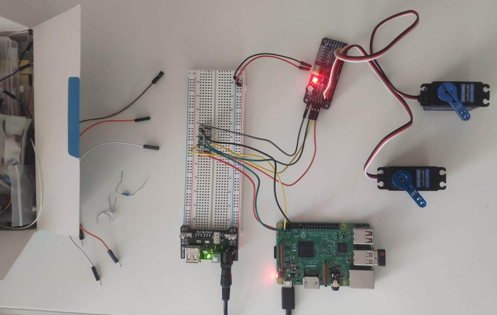

## Introduction

This is a tiny sample application demonstrating the usage of the `pwm_pca9685` crate. I am new to Rust and somewhat new to embedded programming so bear with me. I am planning to use the knowledge gained here in a robotics project I am planning to do in my free time. Shoot me a message if you have feedback.

This should be a fully working example. Hopefully someone can find this useful and can be a complementer to the original introductory blog post by `eldruin`: https://blog.eldruin.com/pca9685-pwm-led-servo-controller-driver-in-rust/

### Building and usage

You should be able just clone it and `cargo run`. Only tested on 32bit Raspbian though.

I believe it won't work on Windows WSL because of the `linux_embedded_hal` dependency but you will want a board with IO pins anyway.

## Setup

- SunFounder SF3218MG servos. I believe they are Chinese company, they might not have sales globally. About $16 each. The documentation is not great.
- The PCA9685 board is manufactured by VKLSVAN. Also a Chinese company, they don't seem to have online presence. About $4.5.
- The compute unit is a Raspberry Pi3B that I had lying around.

See the picture below showing my moderately messy setup. One could just directly connect the RPi to PCA9685 but I need to order a female-female pin cable for that :)

## Details

There are 2 servos, the code will control them from the 2 extremes back and forth and then step through the range (they are going to step in the opposite direction). My servos have 270deg angle range. The 2 channels are defined in 2 `const`s at the top of the code: `LEFT` and `RIGHT`. No particular reason why `#0` and `#12` apart from I am planning to use 12 servos in the end. You can change it easily. I assume the example should be enough to give you an idea to modify it to more or less # of servos.

If you want both servos to do the same thing, it is cleaner to use `set_all_on_off()` instead of `set_channel_on_off()`.

`servo_steps` is kept as a floating point number so that we don't accumulate rounding error in the loop (it has to be an integer though when passed to the `pwm` module).

### Servo min-max

Other PCA9685 sample codes you find on the internet (Python, C++, Rust, whatever) will use different values and the value is dependent on your servo. Originally I just experimented with trial and error to find the boundaries but if I am not mistaken, the calulation is as follows (again, I am new to this):

- The control frequency is 60Hz (this is a default for all servos, my servo does not seem to specify it)
- 60Hz gives us 1/60s (=16,666.666... usec) pulses/periods in the carrier signal
- The data sheet of my servo specifies: `Pulse Width Range: 500 ~ 2500 usec` and `Neutral Position: 1500 usec`
- According to my understanding the PWM signal for a servo always begins at the beggining of the cycle (0th pulse in the carrier signal)
- `PCA9685` has 12-bit resolution = 4096 steps
- So this gives us the calculation for the two extrema:
    - min: `(500 / (1 / 60 * 1000000)) * 4096 = 0.03 * 4096 = 122.88`
    - max: `(2500 / (1 / 60 * 1000000)) * 4096 = 0.15 * 4096 = 614.4`
- In other words:
    - min: 3% duty cycle (the first 3% of the carrier signal is `ON`, the remaining 97% is `OFF`)
    - max: 15% duty cycle (the first 15% of the carrier signal is `ON`, the remaining 85% is `OFF`)

The values for your servo are likely different. The `ON` period doesn't necessarily need to start at the beggining of the signal but it does in this case.

### Address

All `false` is the default address, you can substitute it to the crate's predefined value. All false means none of the address headers/jumpers are soldered. See more details for example here: https://learn.adafruit.com/16-channel-pwm-servo-driver?view=all#addressing-the-boards-848847-3

## Next steps

I might add tiny things but I will keep this as a minimal working example and start a new codebase if I move to the next step with my robotics project.